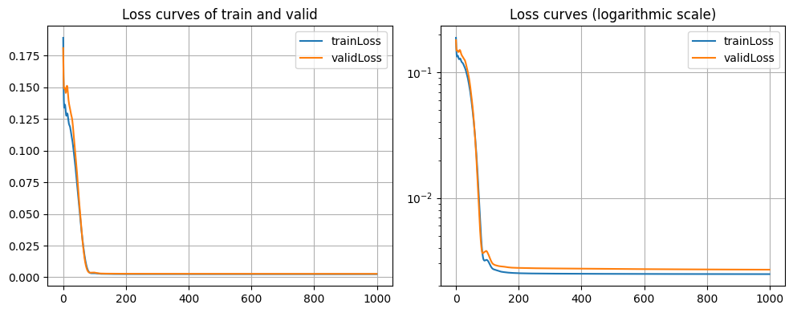
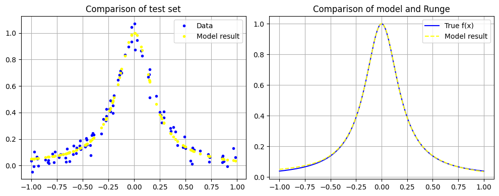
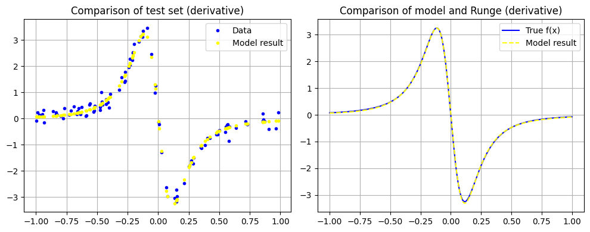

# Week 3 Program Report

## Training Method

### Problem

The goal is to train a neural network that can simultaneously approximate both the function values and the derivative values of the Runge function.  

### Training Data

Three datasets (train, valid, test) were prepared. The function value data contains noise with standard deviation $\sigma_1 = 0.05$, while the derivative value data contains noise with standard deviation $\sigma_2 = \frac{15 \sqrt{3}}{8} \sigma_1$.  

### About the Computation of Derivative Values

By Mean Value Theorem, for a function $f$ that is continuous on $[a, b]$ and differentiable on $(a, b)$, there exists a point $a < c < b$ such that  

$$
f'(c) = \frac{f(b) - f(a)}{b - a}
$$  

In the neural network design that follows, our network is composed of linear layers and the activation function $\text{tanh}(x)$, so it is differentiable on $\mathbb{R}$.  
Therefore, by defining a small $\delta (= 0.001)$, we can approximate  

$$
f'(x) \approx \frac{f(x + \delta) - f(x - \delta)}{2 \delta}
$$  

### Loss Function

Here, I combine the errors of the function values and derivative values into a single MSE loss.  

However, there is a potential problem:  
The function values lie between 0 and 1,  

$$
f(x) \in [0, 1]
$$  

while the range of derivative values, after computation, is  

$$
f'(x) \in \left[-\frac{15 \sqrt{3}}{8}, \frac{15 \sqrt{3}}{8}\right]
$$  

This causes the derivative values to dominate in the MSE loss calculation.  

To address this, I scaled the derivative values into the interval $[0, 1]$ before computing the MSE loss.  
That is,  

$$
\text{Loss} = \frac{1}{2M} \sum^M_{i=1} \left((f(x_i) - h(x_i))^2 + \left(\frac{8}{15 \sqrt{3}}(f'(x_i) - h'(x_i))\right)^2\right)
$$  

## Network Design

| Layer | Neurons or Function |
| :---: | :---: |
| Input Layer | 1 input |
| First Hidden Layer | 10 neurons |
| Activation | $\text{tanh}(x)$ |
| Second Hidden Layer | 10 neurons |
| Activation | $\text{tanh}(x)$ |
| Output Layer | 1 output |  

## Training Process

### Parameters

| Item | Value |
| :---: | :---: |
| Loss Function | MSE loss |
| Optimizer | Adam |
| Learning Rate | 0.01 |
| Training Iterations | 1000 |  

### Loss Curve

It can be observed that the error converges to its minimum within about 200 iterations.  

  

## Results

### Final Loss

| Loss Type | Value |
| :---: | :---: |
| Training Set (compared with noisy data) | $\approx 0.003$ |
| Test Set - Function Values (compared with original function) | $\approx 0.00002$ |
| Test Set - Derivative Values (compared with original function) | $\approx 0.0004$ |  

### Function Value Comparison

It can be seen that the results are almost indistinguishable from the original function.  

  

### Derivative Value Comparison

The derivative values show the same behavior.  

  
