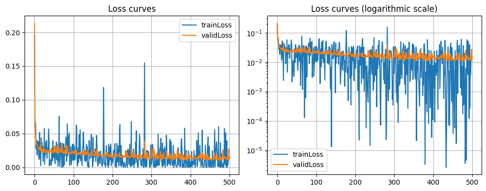
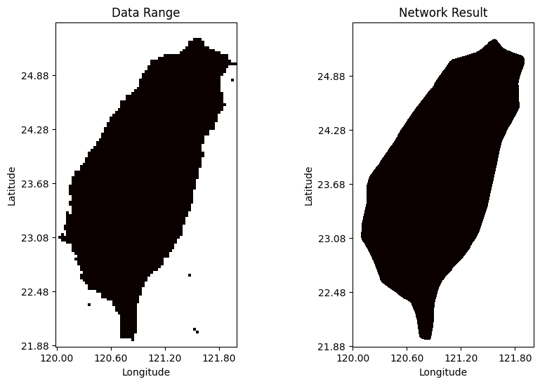

# Week 4 Written Assignment

## Unanswered Questions

在本次的二分類問題中，我分別嘗試了 OneHot + MSELoss 和講義中提到的 BCELoss ，並給予它們完全相同的神經網絡數值。結果發現，它們的結果並沒有多大區別，無論是誤差曲線還是成果圖，都長得差不多。唯一的不同就是 BCELoss 的訓練時間更長。 \
想知道和 MSELoss 比起來，BCELoss 在二分類上的優勢是？ 

## 誤差曲線對比

### MSELoss

### BCELoss

## 結果圖對比

### MSELoss

### BCELoss

## 訓練時長對比

用我的 i5 cpu 跑 \
MSELoss 大約需要 2m \
而 BCELoss 需要 2m53s
