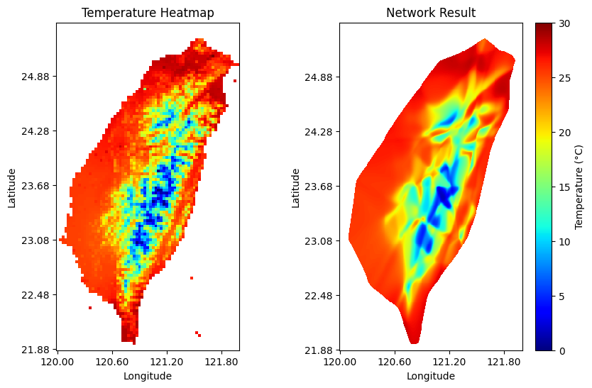

# Week 3 Program Report

## 訓練方法

### 資料處理

首先，把按規定兩種資料打包成 (long, lat, label) 和 (long, lat, value) 格式

原始資料的經緯度範圍為 $[120.00, 121.98]$ 和 $[21.88, 25.45]$\
溫度範圍大約為 $[0, 30]$ \
我將這些數值進行歸一化處理，這將簡化神經網絡的訓練

把資料打包成一個數據集後，這些資料會被隨機按 8:1:1 的比例分為三份 (train, valid, test)

訓練集數據會被分批，以配合模型的訓練

## 模型數值

### 分類問題

| 層級 | 神經元數目 | 激活函數 |
| :---: | :---: | :---: |
| 輸入層 | 2 | - |
| $W_{[2]}$ | 128 | ReLU |
| $W_{[3]}$ | 64 | ReLU |
| $W_{[4]}$ | 32 | ReLU |
| 輸出層 | 1 | Sigmoid |

| 參數 | 值 |
| :---: | :---: |
| Loss函數 | BCELoss |
| 優化器 | Adam |
| 學習率 | 0.001 |
| 分批大小 | 128 |
| 訓練輪數 | 500 |

### 回歸問題

| 層級 | 神經元數目 | 激活函數 |
| :---: | :---: | :---: |
| 輸入層 | 2 | - |
| $W_{[2]}$ | 256 | Tanh |
| $W_{[3]}$ | 128 | Tanh |
| $W_{[4]}$ | 64 | Tanh |
| $W_{[5]}$ | 32 | Tanh |
| $W_{[6]}$ | 16 | Tanh |
| 輸出層 | 2 | Sigmoid |

| 參數 | 值 |
| :---: | :---: |
| Loss函數 | MSELoss |
| 優化器 | Adam |
| 學習率 | 0.001 |
| 分批大小 | 128 |
| 訓練輪數 | 1000 |

## 誤差曲線

### 分類問題

最終驗證誤差大約 0.01

我注意到，誤差曲線出現了大幅度的抖動，這是我個人以往的模型訓練經驗中沒有遇過的 \
經過我~嚴謹的~思考，我猜測：\
這個問題比較簡單，導致模型剛開始訓練就幾乎已經找倒了最低谷，所以這些抖動只不過是谷底的掙扎罷了
> 會這麼想是因為，儘管曲線看起來非常醜陋，但最終結果依舊擬合得很好

所以我作出的對策是：\
降低學習率 (從0.01降到0.001)，讓模型在谷底不要有太大的跳躍，修改後的結果正如下所示

### 回歸問題

最終驗證誤差大約 0.007

## 結果

### 分類問題

測試集誤差大約 0.01

將精度增加 4 倍後，可以看出模型擬合得非常好，結果也很接近真實的地圖

### 回歸問題

測試集誤差大約 0.007

可以看出模型已經有試圖還原出山脈的地形 \
( 注：這裡的邊界沿用了分類模型的結果 )

