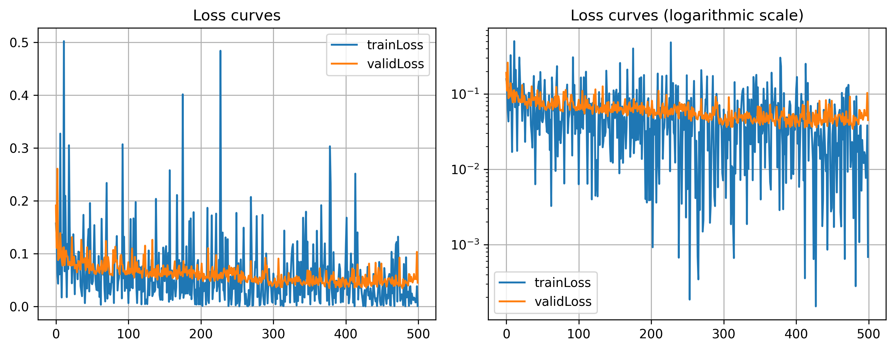

# Week 6 Program Assignment

## Problem 1: Classification using GDA

### (a) Write your own code to implement the GDA algorithm. (Do not use built-in classification functions.)

照要求親手實現了GDA算法，沒有使用內建的或第三方庫的分類函數

### (b) Clearly explain how the GDA model works and why it can be used for classification, in particular this data set.

#### 模型原理

GDA算法以數據滿足高斯分佈為前提假設，計算出最有可能的決策邊界

對於一個二元分類問題（類別 $y = 0 \text{ or } 1$ ），GDA 假設：
- 給定類別 $y = 0$ 時，數據點 $x$ 的條件機率分佈為：$P(x|y=0) \sim N(\mu_0, \Sigma_0)$
- 給定類別 $y = 1$ 時，數據點 $x$ 的條件機率分佈為：$P(x|y=1) \sim N(\mu_1, \Sigma_1)$

在**訓練階段**，我們的程式需要從數據中學習以下三組參數：

1. 先驗機率 (Prior Probability), $\phi$ : 代表某個類別本身出現的機率，即 $P(y)$ 。在程式中，我們用訓練數據中各類別的樣本比例來估計它

2. 均值向量 (Mean Vector), $\mu$ : 代表該類別數據叢集的中心點位置

3. 協方差矩陣 (Covariance Matrix), $\Sigma$ : 描述該類別數據叢集的形狀、大小和延伸方向。一個傾斜的橢圓形分佈會有一個非對角的協方差矩陣

在**預測階段**，對於一個新的數據點 $x$ ，模型會使用貝氏定理來計算它屬於每個類別的後驗機率 $P(y∣x)$

$$ P(y|x) = \frac{P(x|y)P(y)}{P(x)} $$

由於我們只關心哪個類別的機率更大，分母 $P(x)$ 可以忽略。因此，模型會選擇能使分子 $P(x∣y)P(y)$ 最大化的類別作為預測結果

#### 適用性

本數據集是一個台灣島地圖，形狀類似一個橢圓。因此可以使用GDA模型，假設它是一個橢圓，來進行預測。\
但台灣地圖畢竟還是一個不規則的圖形，高斯分佈的假設還是有點太簡單了。最終預測結果並不會準確到哪裡去（至少和後面的Logistic Regression模型比起來，不是太準確）

### (c) Train your model on the given dataset and report its accuracy. Be explicit about how you measure performance.

將資料集隨機分成 `train` 和 `test` 兩部分（比例 8:2），將訓練集丟給模型學習，並以測試集進行評估

測試集準確率：0.84701

這是一個令人滿意的結果，但Logistic Regression模型基本上都會到0.9以上

### (d) Plot the decision boundary of your model and include the visualization in your report.

## Problem 2: Regression

### (a) Implement this combined model in code.

已順利實現

### (b) Apply your model to the dataset and verify that the piecewise definition works as expected.

- 測試集誤差（分類）：0.02748
- 測試集誤差（回歸）：0.00660
- 綜合誤差（上述平均）：0.01704

#### 組合模型的測試集誤差

回憶一下，我們把資料集分成了分類集和回歸集，兩者有不同的target規則：

- 分類集：
  - 若資料點不存在（-999），label = 0
  - 若資料點存在，label = 1
- 回歸集：
  - 若資料點不存在（-999），直接剔除
  - 若資料點存在，保留資料點

所以在評估組合模型的整體測試誤差時，我們需要先想好一個適當的評估方案：

- **測試集** \
    選取分類測試集的-999部分，和回歸測試集的全部（因為回歸集已經剔除掉-999部分了）
- **Loss Function** \
    不作任何標準化處理，直接進MSELoss \
    這麼做會有個問題：正常資料點的值範圍在0~30之間；但無效資料點的值為-999，規模比正常值大得多，會導致誤差評估向分類問題傾斜 \
    一個解法是對target進行標準化處理，不過我認為這樣出來的結果跟上面的分類回歸誤差分開算再平均是一樣的，所以就保留了這個有問題的評估方式

最終結果，測試集誤差 = 15411.9 \
作為對比，一個隨機生成的預測的誤差為 588920.0，上面的結果是可以接受的

### (c) Briefly explain how you built the combined function

寫了一個class `CombineModel` ，它會分別訓練好 `ClassModel` 和 `RegModel` 兩個模型（注：這兩個模型來自作業四），以及儲存每輪的模型結果（後面會展示）

還寫了一個class `Predictor` ，簡化了大部分的外部操作，包含自動標準化，資料維度辨別，模型預測，及組合兩種模型的結果：

$$
h(\vec{x}) = \begin{cases}
    R(\vec{x}), \quad \text{if }C(\vec{x})=1 \\
    -999, \quad \text{if }C(\vec{x})=0.
\end{cases}
$$

### (d) Include plots or tables that demonstrate the behavior of your model

分類模型誤差曲線：\

回歸模型誤差曲線：\

組合模型可視化結果：\

可視化訓練過程：\

